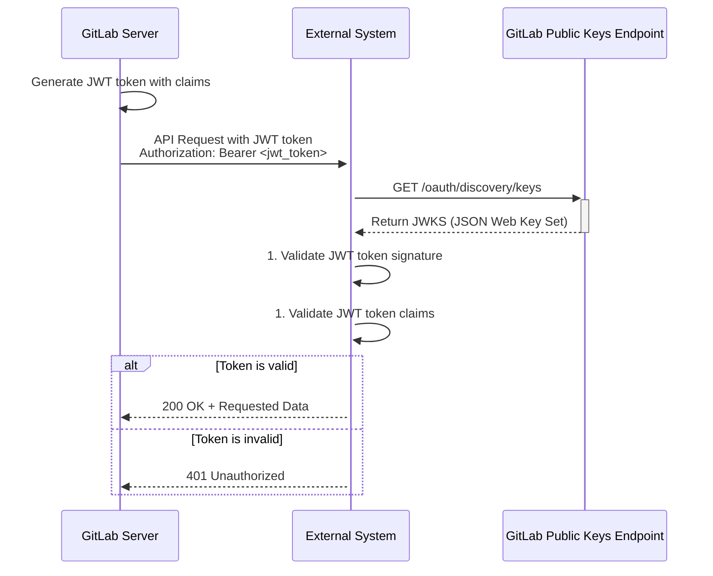

Начиная с версии 15.7 в GitLab есть очень полезная фича - генерация JWT токена в пайплайне. О ней и поговорим.

JWT токены как таковые - очень популярный паттерн при построении интеграций между системами, и GitLab этот тренд не обошел стороной. 

В пайплайне поддерживается конструкция вида:

```yaml
job1:
  id_tokens:
    SOME_JWT_TOKEN:
      aud: "${EXTERNAL_SYSTEM_ADDRESS}"

```
В результате перед выполнением основного тела job будет создан JWT токен с указанным полем `aud` (audience claim) в заголовке и еще большим количеством полей в payload. Созданный JWT токен будет доступен job в качестве значения переменной `SOME_JWT_TOKEN`. Далее скрипт может например приложить этот токен к заголовку HTTP запроса.

GitLab подписывает свои JWT токены при помощи приватного ключа, а публичный ключ для валидации подписи публикует на url: `<gitlab_root>/oauth/discovery/keys`

Важно отметить, что в каждый токен GitLab включает тонну полезных полей, как то: projectId, branchName, environmentName и много чего еще (полный список [здесь](https://docs.gitlab.com/ci/secrets/.id_token_authentication/)).

## В чем польза
Цимес в том, что с этим подходом мы можем дать GitLab доступ во внешнюю систему, и не хранить абсолютно никаких секретов на стороне GitLab 🤩

Представим, что мы хотим предоставить нашему GitLab серверу доступ в некую внешнюю систему, тогда мы можем:
- сообщить ей URL для получения GitLab public keys
- включить аутентификацию при помощи JWT токена
- задать правила проверки токена на основании его полей, например
    - aud=external-system-url
    - project_id=x
    - environment=production

## Схема взаимодействия
Схематично использования JWT токена выглядит так:


## Как можно использовать
Есть следующие варианты использования такой конструкции:
- **Провайдеры секретов**. Наиболее употребимый и максимально полезный сценарий - это ходить за секретами в secret providers такие как HashiCorp Vault, OpenBao и т. д. Хранить секреты россыпью в CI/CD переменных разных пайплайнов, на уровне групп и так далее в GitLab - это боль. Данный подход позволяет убрать все чувствительные данные в централизованное хранилище секретов.
- **Облачные сервисы**. Выкладка в облака или разворачивание инфраструктуры - это другой популярный сценарий.
- **Custom applications**. В роли внешней системы может быть любое свое кастомное приложение, которое поддерживает JWT аунтентификацию, в том числе разработанное внутри компании.